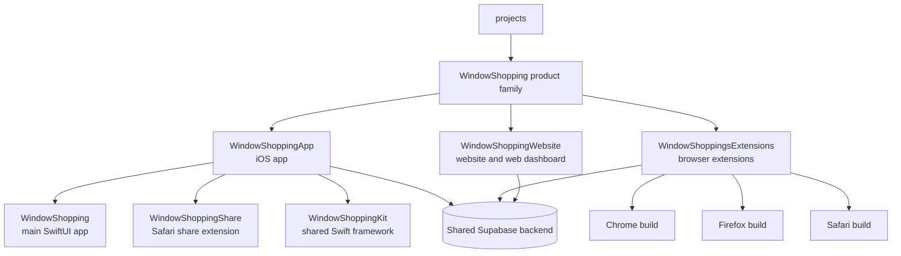

# Projects

## Project map



## AgentOS

[AgentOS](AgentOS/README.md) is a personal dashboard page: Google Calendar, TickTick tasks, WindowShopping extension analytics (installs, uninstalls, daily usage), and an agent-written brief. A scheduled Claude Code run refreshes `AgentOS/data/snapshot.json` through the MCP connectors; the page is static HTML served locally.

## WindowShopping

`WindowShopping/` is an umbrella folder for three independent Git repositories that make up the same product family. All three clients use the same Supabase backend for authentication and synchronized product data.

| Project | Purpose | Main parts | Technology |
| --- | --- | --- | --- |
| [WindowShoppingApp](WindowShopping/WindowShoppingApp/README.md) | Native iOS client with product management and Safari capture. | `WindowShopping` app, `WindowShoppingShare` extension, `WindowShoppingKit` framework, Supabase migrations and functions | SwiftUI, XcodeGen, Supabase |
| [WindowShoppingsExtensions](WindowShopping/WindowShoppingsExtensions/README.md) | Cross-browser product saver, price tracker, and alerting client. | Shared extension source, Chrome, Firefox, and Safari builds, packaging scripts, Supabase migrations and functions | JavaScript, WebExtensions APIs, Supabase |
| [WindowShoppingWebsite](WindowShopping/WindowShoppingWebsite/README.md) | Public marketing site and authenticated product dashboard. | Static pages, browser-side app modules, tests, Supabase migrations and functions | HTML, CSS, JavaScript, Supabase |

### Repository layout

```text
WindowShopping/
|-- WindowShoppingApp/             iOS app repository
|   |-- WindowShopping/            Main SwiftUI application
|   |-- WindowShoppingShare/       Safari share extension
|   |-- WindowShoppingKit/         Shared models, data access, extraction, and UI
|   `-- supabase/                  Backend migrations and Edge Functions
|-- WindowShoppingsExtensions/     Browser extension repository
|   |-- extensions/
|   |   |-- chrome/                Generated Chrome build
|   |   |-- firefox/               Generated Firefox build
|   |   `-- safari/                Generated Safari build
|   |-- scripts/                   Build and packaging scripts
|   `-- supabase/                  Backend migrations and Edge Functions
`-- WindowShoppingWebsite/         Website repository
    |-- js/                        Browser-side application modules
    |-- tests/                     Node tests
    `-- supabase/                  Backend migrations and Edge Functions
```
